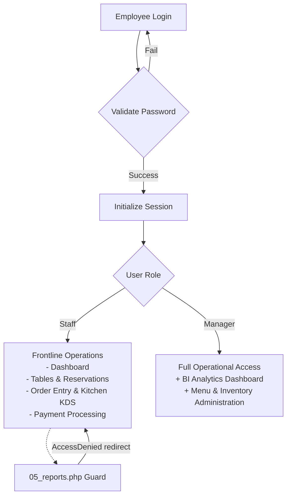

# POS Web Client & Backend Application Core

This directory contains the operational web interface and backend business logic for the Restaurant Point of Sale (POS) and reporting platform.

---

##  Architecture & Component Modules

The application architecture utilizes native PHP with session-based authentication, modular role guards, dynamic SQL-backed UI views, and responsive styling.

### Component Directory Map

```
POS_web/
├── 00_0register_employee.php       # Staff registration interface with bcrypt hashing access only by admin
├── 00_db_connect.php              # Centralized MySQLi database connection provider
├── 00_login.php                   # Authentication UI portal
├── 00_login_process.php           # Credential verification & session bootstrapper
├── 00_logout.php                  # Session destruction & security cleanup
├── 01_dashboard.php               # Operational hub: Table status, quick actions, KPIs
├── 02_reservation.php             # Reservation booking system with customer management
├── 02_tables.php                  # Interactive floor plan & table seating management
├── 03_order_item_status_update.php # Kitchen station line-item state transitions (AJAX/POST)
├── 03_orders.php                  # Order basket creation & line-item dispatch
├── 03_orders_process_payment.php  # Transactional checkout & receipt generation
├── 04_menu.php                    # Menu catalog, pricing, and live inventory control
├── 05_reports.php                 # Executive BI Analytics Dashboard (RBAC: Manager only)
└── 09_style.css                   # Global UI styling, layouts, and responsive components
```

---

## Role-Based Access Control (RBAC)

The application enforces role separation at the routing level:



* **Staff Role**: Access to operational workflows (Tables, Orders, Reservations, Kitchen Status). Direct navigation to `05_reports.php` is blocked by session validation and redirects with `error=AccessDenied`.
* **Manager Role**: Full administrative permissions including menu pricing changes, inventory stock adjustments, and access to executive BI reporting.

---

## Business Intelligence (BI) Analytics Engine (`05_reports.php`)

The BI module aggregates transactional data across custom date horizons (`today`, `yesterday`, `7d`, `30d`):

1. **Volume & Average Ticket Metrics**:
   * **Gross Sales Volume**: Calculated via aggregated receipt sums:
     $$\text{Total Sales} = \sum \text{paid\_amount}$$
   * **Transaction Counts**: Distinct count of receipts settled.
   * **Average Ticket Size (AOV)**:
     $$\text{Average Ticket Size} = \frac{\text{Gross Sales}}{\text{Total Orders}}$$
   * **Party & Table Utilization**: Unique tables seated and served within the window.

2. **Hourly Sales Trend**:
   * Extracts `HOUR(created_at)` from `RECEIPT` joined with `SALES` to chart demand curves and identify peak operational rushes.

3. **Top Performing Menu Items**:
   * Aggregates quantity and item revenue from `SALES` to guide inventory replenishment and kitchen prep schedules.

---

## Kitchen Display System & Order Lifecycle

```
[Received] ──(Cook begins prep)──> [Preparing] ──(Plate ready)──> [Finished]
                                                                     │
                                                    (Triggers Inventory Deduction)
                                                                     │
                                                    (Auto-sets Basket to 'complete')
                                                                     │
                                                    (Unlocks Receipt Generation)
```

1. Orders are submitted as baskets (`ORDER_BASKET`) with items (`ORDERED_ITEM`).
2. Line items start with status `'received'`.
3. Kitchen staff updates status via `03_order_item_status_update.php` to `'preparing'` and `'finished'`.
4. When all items in a basket are marked `'finished'`, MySQL triggers transition the basket status to `'complete'` and deduct item counts from inventory (`MENU.amount`).
5. Payment can only proceed once all table baskets are `'complete'`, strictly enforced by database trigger `trg_invoice_gate`.
