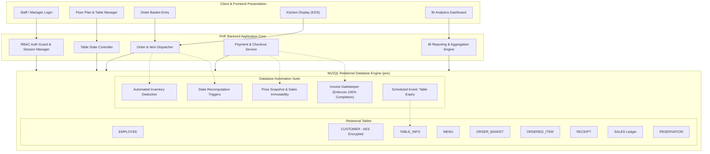

# Restaurant Point of Sale (POS) & Business Intelligence (BI) Analytics Platform

[](https://www.php.net/)
[](https://www.mysql.com/)

full-stack Restaurant Management, Point of Sale (POS), and Business Intelligence (BI) analytics system. Built with **database-level automation triggers**, the platform unifies real-time table floor plans, kitchen display order routing, automated inventory deduction, and executive financial reporting.

---

## Executive Summary & Engineering Highlights

Based on core system engineering deliverables:

* **Operational Workflows & MySQL Architecture**: Architected end-to-end operational workflows and a normalized relational MySQL database schema, translating complex multi-stage restaurant operations (reservations, seating, multi-basket ordering, kitchen dispatch, and payment reconciliation) into robust backend logic.
* **Database-Level Automation & Transactional Consistency**: Implemented native database triggers, stored procedures, and MySQL Event Schedulers to enforce strict state transitions, transactional consistency via invoice gatekeepers, double-booking prevention, and automated real-time inventory deductions upon order fulfillment.
* **Business Intelligence (BI) Analytics Dashboard**: Engineered an executive BI reporting suite calculating daily sales volumes, order throughput, customer party counts, hourly rush trends, and average ticket size via complex SQL multi-table aggregations, secured with strict Role-Based Access Control (RBAC).
* **Data Security & Privacy Compliance**: Implemented column-level AES-256 data encryption at rest for customer Personally Identifiable Information (PII) and bcrypt password hashing for staff authentication.

---

## System Architecture & Workflow



---

## Project Repository Structure

Organized into clean, production-standard architectural directories while preserving original operational source code intact:

```
├── database/                  # Relational Database Architecture & Scripts
│   ├── migrations/            # Version-controlled schema & state migrations
│   │   ├── 01_create_schema.sql         # DDL definitions & foreign keys
│   │   ├── 02_security_dcl.sql          # Least-privilege users & permissions
│   │   ├── 03_views_and_procedures.sql  # Encrypted views & stored procedures
│   │   └── 04_triggers_and_events.sql   # Automation triggers & event scheduler
│   ├── seeds/                 # Baseline mock data for development
│   │   └── 01_seed_pos_data.sql         # Initial staff, menu, tables & receipts
│   └── README.md              # Deep-dive database architectural documentation
├── POS_web/                   # Web Application Client & Backend Logic
│   ├── 00_0register_employee.php       # Staff registration (bcrypt hashing) only access by admin
│   ├── 00_db_connect.php              # Centralized MySQLi connection provider
│   ├── 00_login.php                   # Authentication login interface
│   ├── 00_login_process.php           # Session initialization & authentication
│   ├── 00_logout.php                  # Session invalidation & teardown
│   ├── 01_dashboard.php               # Operational overview & rapid actions
│   ├── 02_reservation.php             # Reservation management with customer AES
│   ├── 02_tables.php                  # Interactive table floor plan & status
│   ├── 03_order_item_status_update.php # Kitchen order status state machine
│   ├── 03_orders.php                  # Order creation & line-item dispatcher
│   ├── 03_orders_process_payment.php  # Checkout & receipt generator (trigger-gated)
│   ├── 04_menu.php                    # Menu catalog & stock level adjustments
│   ├── 05_reports.php                 # Executive BI Analytics (RBAC Manager-only)
│   ├── 09_style.css                   # Global responsive styling
│   └── README.md                      # Web application architecture guide
├── .gitignore                
└── README.md                  # Unified system documentation (this file)
```

---

## Database Automation Suite & Business Logic

All core business rules are guaranteed at the database layer via triggers, stored procedures, and scheduled events:

| Trigger / Event | Timing & Event | Business Rule Enforced |
| :--- | :--- | :--- |
| **`trg_order_status_recompute_insert`** | `AFTER INSERT ON ORDERED_ITEM` | Recalculates parent `ORDER_BASKET.status`. When all items reach `'finished'`, sets basket to `'complete'`. |
| **`trg_order_status_recompute_update`** | `AFTER UPDATE ON ORDERED_ITEM` | Dynamically transitions basket between `'incomplete'` and `'complete'`. Automatically **deducts menu inventory** (`MENU.amount - NEW.amount`) when item is finished. |
| **`trg_invoice_gate`** | `BEFORE INSERT ON RECEIPT` | **Strict Transactional Gatekeeper**: Throws an exception (`SQLSTATE 45000`) if any active basket for the table is incomplete, preventing billing errors. |
| **`trg_price_snapshot_on_order`** | `AFTER INSERT ON ORDERED_ITEM` | Computes and snapshots the basket total dynamically to protect against future menu price fluctuations. |
| **`trg_reservation_guard`** | `BEFORE INSERT ON RESERVATION` | Prevents double-booking by checking a 2-hour window buffer and rejecting reservations for tables currently occupied within 1 hour. |
| **`trg_receipt_nodelete`** | `BEFORE DELETE ON RECEIPT` | Financial audit lock: Blocks any deletion of receipts to guarantee immutable sales records. |
| **`trg_cancel_reservation_free_table`** | `AFTER DELETE ON RESERVATION` | Automatically transitions table status from `'reserved'` back to `'available'`. |
| **`evt_expire_reservations`** | `EVERY 1 DAY` | Scheduled MySQL background event that frees tables tied to expired reservations. |

---

## Business Intelligence (BI) Analytics Engine

The executive reporting dashboard `POS_web/05_reports.php` empowers management with real-time operational metrics and historical analytics across flexible date intervals (`Today`, `Yesterday`, `Last 7 Days`, `Last 30 Days`):

* **Gross Sales Volume**: Calculated via aggregated sums over `RECEIPT.paid_amount` and validated against `SALES.item_total`.
* **Transaction Count**: Total completed billing receipts processed in the timeframe.
* **Average Ticket Size (AOV)**:
  $$\text{Average Ticket Size} = \frac{\sum \text{Sales Volume}}{\text{Total Orders}}$$
* **Table & Customer Turn Rate**: Aggregates distinct party visits and table occupancies.
* **Hourly Demand Distribution**: Groups sales receipts by `HOUR(r.created_at)` to pinpoint peak dining rushes and optimize staffing schedules.
* **Top-Selling Item Matrix**: Aggregates unit volume and gross revenue per menu item to inform kitchen prep and inventory purchasing.

---

## Security, RBAC & Column-Level Encryption

1. **Role-Based Access Control (RBAC)**:
   * **Manager**: Unrestricted access across the system, including menu pricing, employee registration, and executive BI analytics.
   * **Staff**: Restricted to frontline operations (floor plan, order basket creation, kitchen order status updates, and payment checkout). Unauthorized access attempts to reports trigger immediate route redirection with security error logs.
2. **Database Least Privilege (DCL)**:
   * Dedicated `Webemployees` user granted `SELECT, INSERT, UPDATE` on operational tables, restricted column-level `UPDATE(status)` on orders, and execution rights on safe stored procedures, with all DDL privileges stripped.
3. **Data Protection & PII Encryption**:
   * Customer records are protected using AES-256 (`AES_ENCRYPT` / `AES_DECRYPT`) with SHA-1 keying for sensitive PII (`First_Name`, `Last_Name`, `allergies`, `phone`, `email`).
   * Decryption is exposed strictly through controlled database views (`v_decrypted_customers`) for authorized staff.

---

## Setup & Installation Guide

### Prerequisites
* **PHP**: 8.0 or higher with the `mysqli` extension enabled.
* **MySQL Server**: 8.0 or higher (or MariaDB 10.4+).
* **Web Server**: Apache / Nginx (or PHP built-in web server, XAMPP, WAMP, MAMP, LAMP).

---

### Step 1: Database Setup

1. Open your terminal or MySQL console:
   ```bash
   mysql -u root -p
   ```

2. Create the database and run the sequential migration scripts:
   ```sql
   CREATE DATABASE pos;
   USE pos;

   -- 1. Create tables and relationships
   SOURCE database/migrations/01_create_schema.sql;

   -- 2. Configure user permissions & RBAC (Provide your password, or change user name)
   SOURCE database/migrations/02_security_dcl.sql;

   -- 3. Create views and stored procedures
   SOURCE database/migrations/03_views_and_procedures.sql;

   -- 4. Set up automation triggers and event scheduler
   SOURCE database/migrations/04_triggers_and_events.sql;

   -- 5. Populate baseline seed data
   SOURCE database/seeds/01_seed_pos_data.sql;
   ```

> **Note**: You can also import these scripts in order using **phpMyAdmin** or your preferred MySQL GUI client (e.g., MySQL Workbench, DBeaver).

---

### Step 2: Configure Database Connection

Check `00_0register_employee.php`, `POS_web/00_db_connect.php` to ensure credentials match your MySQL server configuration:

```php
$servername = "localhost";    
$username   = "<Your user name/provided default>";   
$password   = "<Your password>";   
$dbname     = "pos"; 
```

*(Optional: use root or your custom MySQL credentials if testing locally).*

---

### Step 3: Run the Application

#### Option A: Using PHP Built-In Development Server (Fastest)

Navigate to the project root in your terminal and run:

```bash
php -S localhost:8000 -t POS_web
```

Open your browser and navigate to:
```
http://localhost:8000/00_login.php
```

#### Option B: Using XAMPP / WAMP / Apache

1. Move or clone the project folder into your web root (e.g., `C:/xampp/htdocs/pos` or `/var/www/html/pos`).
2. Start Apache and MySQL services in the control panel.
3. Open your browser and navigate to:
   ```
   http://localhost/pos/POS_web/00_login.php
   ```

---

### Step 4: Login & Default Credentials (Testing)

| Role | Account Name | Password | Access Scope |
| :--- | :--- | :--- | :--- |
| **Manager** | `Sarah Miller` | `password123` | Full Access: BI Dashboard, Menu Management, Seating, Floor Plan, Orders |
| **Staff** | `John Smith` | `password123` | Operational Access: Seating, Order Placement, Kitchen Station, Checkout |

*New staff and manager accounts can also be registered at `00_0register_employee.php`.*

---
