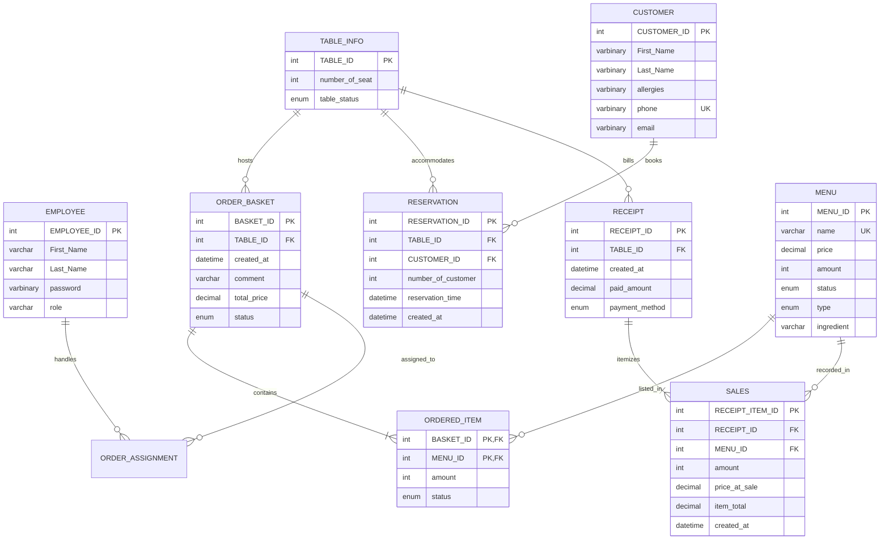

# Database Architecture & Automation Suite

This directory houses the complete relational database architecture, schema migrations, security scripts, stored routines, triggers, and baseline seed data for the **Restaurant Point of Sale (POS) with Table management** platform.

---

### Entity Relationship Diagram



---

## Migration Structure

The database scripts are organized sequentially under `database/migrations/` and `database/seeds/`:

| File | Description | Execution Order |
| :--- | :--- | :--- |
| `01_create_schema.sql` | DDL: Creates 9 core relational tables, primary keys, and foreign keys with cascading actions. | `1` |
| `02_security_dcl.sql`| DCL: Creates database users (please provide your password) and enforces granular Role-Based Access Control (RBAC) and least privilege. | `2` |
| `03_views_and_procedures.sql` | Stored Procedures (`sp_insert_customers`, `sp_update_table_status`) and secure decrypted reporting Views. | `3` |
| `04_triggers_and_events.sql` | Business logic automation: State transition triggers, inventory deduction, transactional gating, and event scheduling. | `4` |
| `01_seed_pos_data.sql`| Baseline seed records: Staff accounts, table floor plan, menu items, sample orders, and receipts. | `5` |

---

## Database-Level Automation Suite

To guarantee strict transactional consistency without relying solely on application-level integrity, all constraints and transitions are enforced natively within the MySQL database engine.

### 1. State Transitions & Auto-Recomputation
* **`trg_order_status_recompute_insert`** & **`trg_order_status_recompute_update`**:
  * Monitors `ORDERED_ITEM` status changes.
  * When all line items within a basket reach `'finished'`, the parent `ORDER_BASKET` automatically transitions to `'complete'`.
  * If any item is pending (`'received'` or `'preparing'`), the basket status remains `'incomplete'`.

### 2. Automated Real-Time Inventory Deduction
* **Trigger Logic on `ORDERED_ITEM`**:
  * Upon transitioning an item status to `'finished'`, the database automatically executes:
    ```sql
    UPDATE MENU
    SET amount = amount - NEW.amount
    WHERE MENU_ID = NEW.MENU_ID;
    ```
  * Keeps menu stock strictly consistent across concurrent server operations.

### 3. Transactional Integrity & Invoice Gatekeeper
* **`trg_invoice_gate`**:
  * Prevents receipt creation (`BEFORE INSERT ON RECEIPT`) if a table has incomplete orders.
  * Throws SQL error `SQLSTATE 45000: 'Cannot create receipt: Table has X incomplete orders'`.
  * If `paid_amount` is not provided, automatically aggregates the total bill directly from verified baskets.

### 4. Sales History Immutability & Audit Trail
* **`trg_receipt_nodelete`**:
  * Blocks receipt deletion (`BEFORE DELETE ON RECEIPT`) with `SQLSTATE 45000: 'Receipt deletion is not allowed - sales history must be preserved'`.
  * Guarantees non-repudiation and regulatory compliance for financial records.

### 5. Table Lifecycle Cleanup & Double-Booking Guard
* **`trg_reservation_guard`**:
  * Validates table availability before accepting reservations.
  * Rejects reservation creation if table is occupied within 1 hour or if another reservation exists within a 2-hour window.
* **`trg_cancel_reservation_free_table`**:
  * Automatically returns table status to `'available'` when the last active reservation is removed.
* **`trg_table_available_cleanup`**:
  * Purges abandoned incomplete items and baskets when a table is reset to `'available'`.

### 6. Scheduled Event Automation
* **`evt_expire_reservations`**:
  * MySQL Event Scheduler recurring daily job.
  * Automatically transitions tables with past-due reservations back to `'available'`.

---

## Data Protection & Column Encryption

Customer Personally Identifiable Information (PII) is encrypted at rest using AES-256 column-level encryption with SHA-1 key hashing:

* Encrypted Fields: `First_Name`, `Last_Name`, `allergies`, `phone`, `email`.
* Automated Stored Procedure: `sp_insert_customers()` encrypts parameters before persisting into `CUSTOMER`.
* Decryption View: `v_decrypted_customers` securely casts decrypted binary data to characters for authorized services.

---

## Database User Privilege Matrix (DCL)

| User | Scope | Permissions Granted | Excluded Privileges |
| :--- | :--- | :--- | :--- |
| `posadmin` | Global (`pos.*`) | `ALL PRIVILEGES` | None |
| `Webemployees` | Operational Tables | `SELECT, INSERT, UPDATE` on core tables; restricted `UPDATE(status)` on orders. | No `ALTER`, `DROP`, `INDEX`, or direct DDL access. |
| `Webcustomer` | Public Read | `SELECT` on `TABLE_INFO` and `MENU`. | No mutation or employee data access. |
